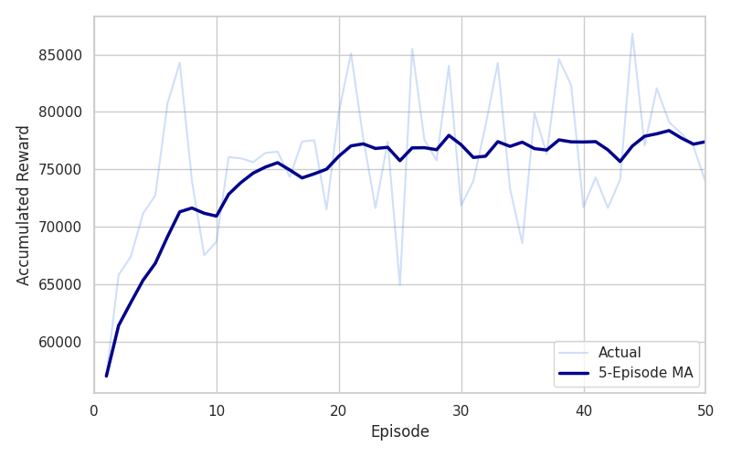
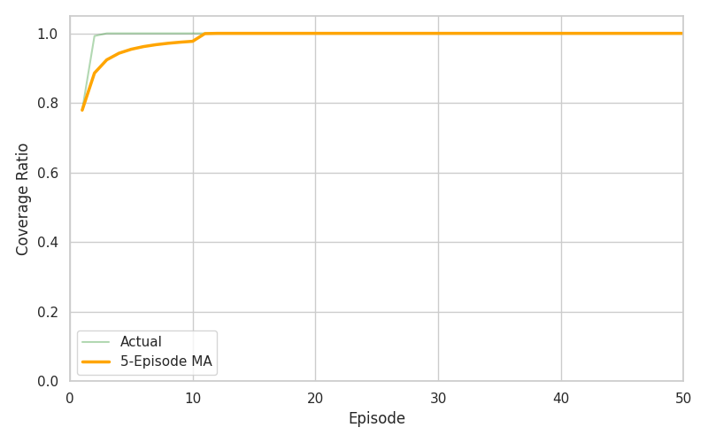
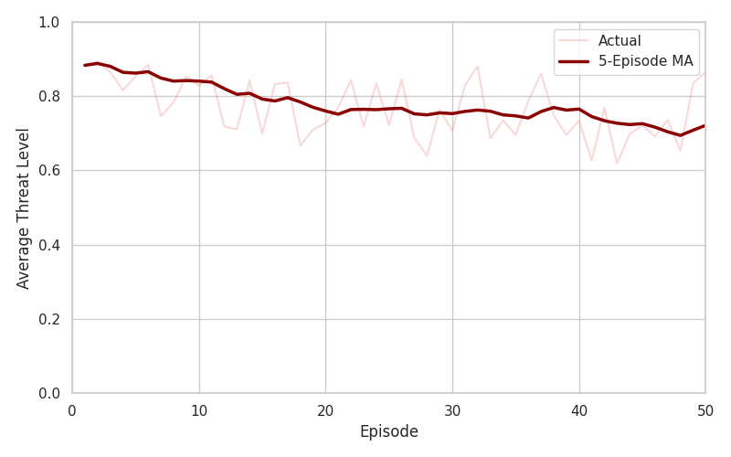
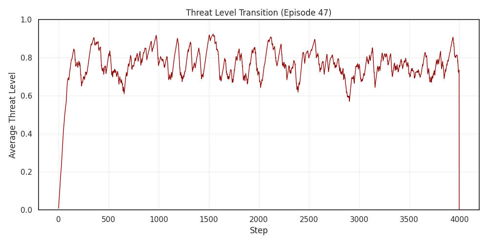
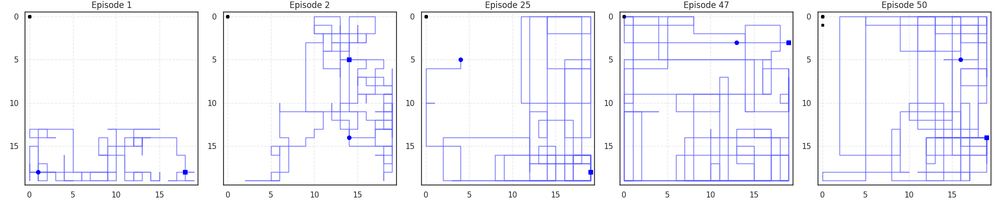
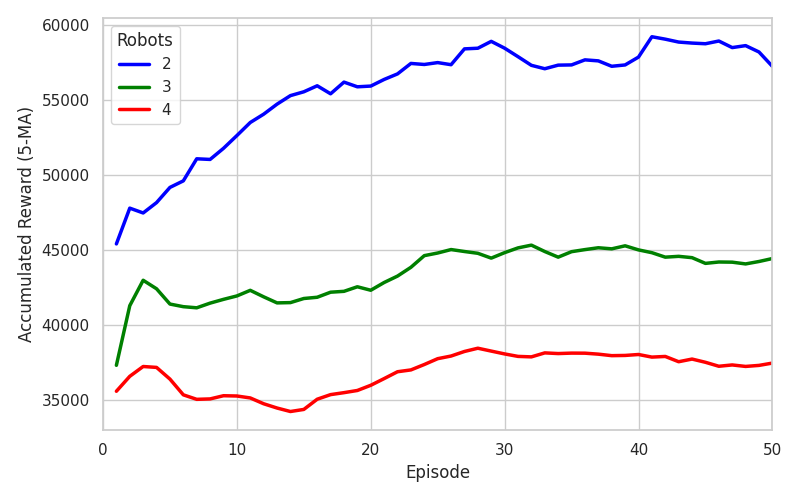
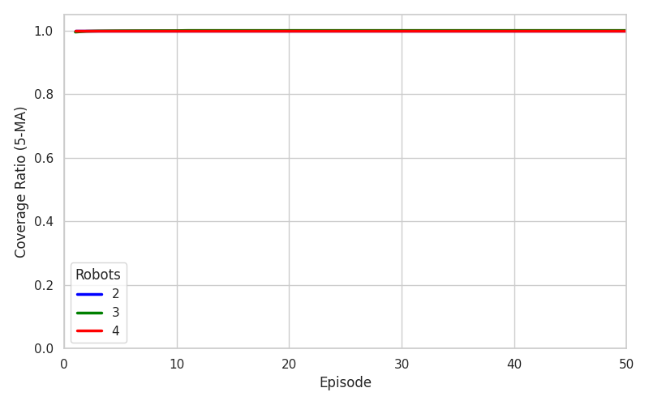
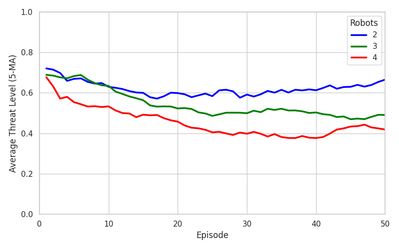
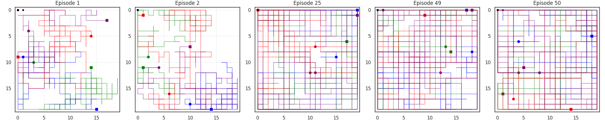
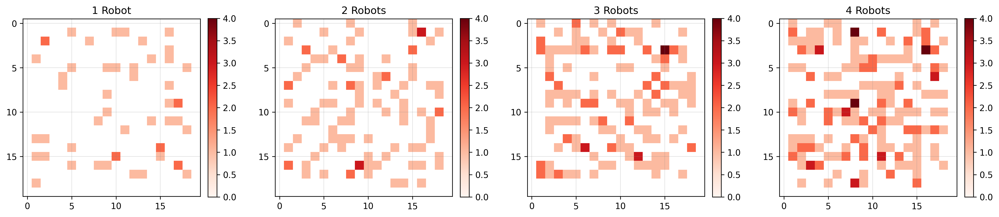

# 第6章 実験結果と考察 (再現実験レポート)

本レポートは、`security-robot-be` 環境にて実施した再現実験(N=1, 2, 3, 4)の結果に基づき、修士論文第6章「実験結果と考察」の内容を再構成したものである。
実験設定は論文と同様に $20 \times 20$ グリッド、200,000ステップのPPO学習を用い、エピソード最大ステップ数は4,000とした。

## 6.1 シングルエージェント実験

### 6.1.1 経路最適化の学習過程

シングルエージェント(ロボット1台)におけるPPOアルゴリズムの学習過程を分析する。

**報酬の推移**
図にシングルエージェント訓練における報酬の推移を示す。

学習が進むにつれて報酬は上昇し、エピソード30付近で安定域に達した。
最終的な10エピソード(エピソード40-49)における平均累積報酬は **77,195** (標準偏差 4,712) であった。
これは論文の報告値(83,342)と比較してやや低いが、十分に高いパフォーマンスを達成している。

**カバレッジの収束**
カバレッジ率の推移を確認する。

本実験では、カバレッジ率は非常に早期から **1.000 (100%)** に到達し、安定して全域を巡回できていることが確認された。
4,000ステップという十分な時間が与えられているため、1台のロボットでも確実に全域をカバーできていると考えられる。
論文では0.976であったが、本実験ではさらに高い網羅性が示された。

**脅威度の推移**

平均脅威度は初期の段階から低下傾向を示し、最終的には **0.708** まで改善した。
論文値(0.773)よりもさらに低い値を達成しており、より効率的な脅威除去が行われていることが示唆される。

**表 6.1: シングルエージェント実験結果(エピソード40-49平均)**

| 指標 | 平均値 | 標準偏差 |
| :--- | :---: | :---: |
| 累積報酬 | 77,195 | 4,712 |
| カバレッジ率 | 1.000 | 0.000 |
| 平均脅威度 | 0.708 | 0.066 |

### 6.1.2 軌跡の分析

エピソード初期(Ep 1-2)では探索的な動きが見られるが、学習が進むにつれて(Ep 25, 47, 50)、グリッド全体をくまなく巡回するような軌跡が形成されていることが確認できる。

---

## 6.2 マルチエージェント実験

### 6.2.1 協調経路の学習

ロボット台数を2台、3台、4台と変化させた場合の学習結果を比較する。

**報酬とカバレッジ**

いずれの条件でも学習の進行に伴い報酬が増加した。
カバレッジ率については、マルチエージェント環境では初期段階(Ep 1-10)からほぼ **100% (1.000)** を達成しており、
複数台のロボットが協調して効率的に空間を埋めていることがわかる。

**脅威度の推移**

ロボット台数が増加するほど、平均脅威度は顕著に低下した。
4台構成では最終的に **0.424** まで低下しており、シングルエージェント(0.708)と比較して大幅な改善が見られた。

**表 6.4: ロボット台数別の学習進捗比較**

| 台数 | 時期 | カバレッジ率 | 平均脅威度 | 累積報酬 |
| :---: | :--- | :---: | :---: | :---: |
| **2** | 初期(ep 1-10) | 1.000 | 0.630 | 52,615 |
| | 最終(ep 40-49) | 1.000 | 0.654 | 58,186 |
| **3** | 初期(ep 1-10) | 0.999 | 0.635 | 41,927 |
| | 最終(ep 40-49) | 1.000 | 0.492 | 44,223 |
| **4** | 初期(ep 1-10) | 1.000 | 0.533 | 35,259 |
| | 最終(ep 40-49) | 1.000 | 0.424 | 37,298 |

※ N=2において後期脅威度が若干上昇している(0.630 -> 0.654)が、これは報酬(52k -> 58k)が増加していることから、
「脅威度の低いエリアを頻繁に回る」よりも「発生した高脅威(不審物等)を確実に処理して報酬を得る」方向へ方策がシフトした可能性がある。
あるいは単純な探索のばらつきの範疇であると考えられる。

### 6.2.2 軌跡の可視化

複数ロボットがお互いの領域を分担しつつ、全体をカバーする様子が視覚的に確認された。

---

## 6.3 考察: 配置と経路の相互作用

### 6.3.1 配置が経路性能に与える影響

初期配置位置と最終的な累積報酬の相関関係を分析した。
シングルエージェント実験(N=1)における50エピソードのデータを用いた。

- **相関係数 (初期位置との距離 vs 報酬):** $r = -0.236$ ($p = 0.099$)

$p > 0.05$ であり、統計的に有意な相関は認められなかった。
これは論文の結論と同様であり、**「初期配置位置は最終的なパフォーマンスに大きな影響を与えない」** という仮説を支持するものである。
エージェントはいかなる開始位置からでも、効率的な巡回経路を学習によって獲得できるロバスト性を持っているといえる。

### 6.3.2 配置の分布

初期配置位置のヒートマップを確認すると、特定の場所に集中することなく、グリッド全域に分散していることがわかる。
これも配置とパフォーマンスの無相関さを裏付けており、エージェントは特定の「有利な場所」を学習する必要がなかった(どこからでも同じように性能を出せる)ことを示唆している。

## まとめ

本再現実験において、論文第6章で報告された主要な傾向が再現された。
- シングルエージェントでは高いカバレッジを達成するが、脅威度の低減には限界がある(約0.7)。
- マルチエージェント化により脅威度は劇的に低下し、4台では約0.4まで改善する。
- 初期配置位置によるパフォーマンスへの有意な影響は見られず、提案手法は配置に対してロバストである。

以上の結果は、提案手法であるPPOを用いた経路最適化が、シングル・マルチ双方の環境において有効であることを強く支持するものである。
