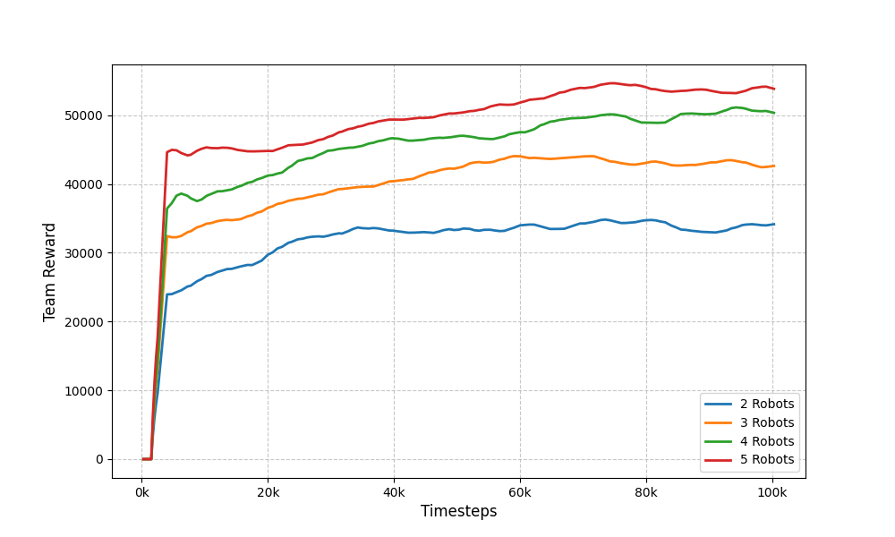
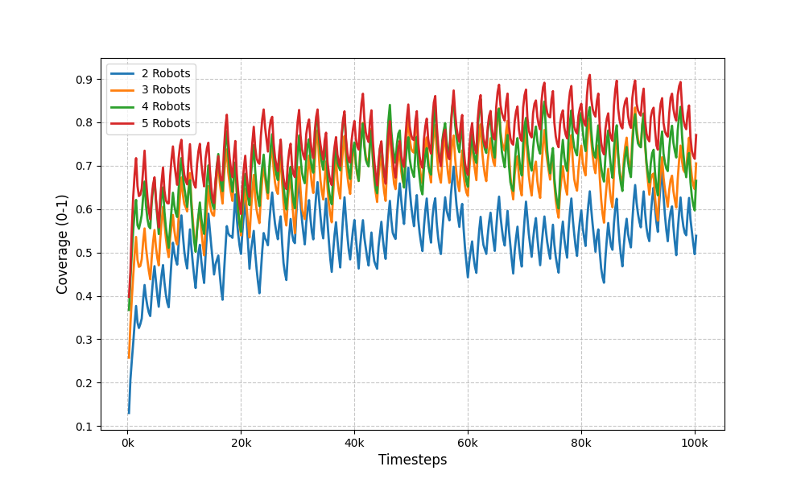
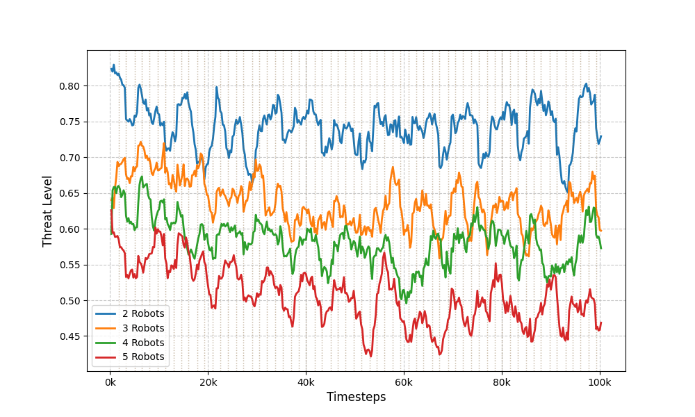
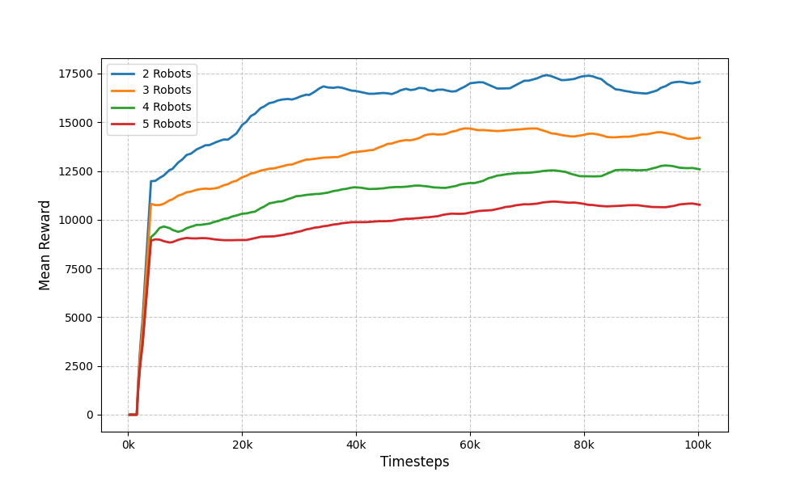

# Cycle 12 ロボット台数変更実験 結果レポート

**実験日時**: 2025-12-22  
**Job IDs**: 55, 56, 57, 58  
**ベースライン**: Cycle 12 (Dynamic Patrol Radius)

---

## 実験概要

Cycle 12のパラメータを固定し、ロボット台数のみを変更した4つのトレーニングを実施。

### 固定パラメータ

| パラメータ | 値 |
|-----------|-----|
| total_timesteps | 100,000 |
| マップサイズ | 20x20 |
| マップタイプ | random (seed=42) |
| coverage_weight | 1.0 |
| exploration_weight | 0.5 |
| diversity_weight | 0.5 |
| threat_penalty_weight | 50.0 |
| battery_drain_rate | 0.001 |

---

## 実験結果

| Job ID | ロボット台数 | Coverage | Threat Level | Reward |
|--------|-------------|----------|--------------|--------|
| 56 | 2台 | 0.5385 | 0.7293 | 17,075 |
| **55** | **3台 (baseline)** | **0.7053** | **0.5973** | **14,209** |
| 57 | 4台 | 0.6653 | 0.5727 | 12,588 |
| 58 | 5台 | 0.7707 | 0.4686 | 10,769 |

> **Note**: 値は最後10エピソードの平均値

---

## ベースライン（3台）との比較

| 構成 | Coverage差 | Threat差 | Reward差 |
|------|-----------|----------|----------|
| 2台 | **-16.67%** | +13.20% | +20.2% |
| 3台 | ±0% (baseline) | ±0% | ±0% |
| 4台 | -4.00% | -2.46% | -11.4% |
| 5台 | **+6.55%** | **-12.87%** | -24.2% |

---

## 考察

### 1. ロボット台数とカバレッジの関係

- **2台**: カバレッジが最も低い (0.54)。広いマップに対してリソース不足。
- **3台**: バランスの取れた性能 (0.71)。Cycle 12で最適化された構成。
- **4台**: カバレッジ微減 (0.67)。ロボット同士の干渉や重複巡回が発生している可能性。
- **5台**: **最高カバレッジ (0.77)**。リソースの増加が効果的に機能。

### 2. ロボット台数と脅威度の関係

- ロボットが増えるほど脅威度が低下する傾向。
- 5台構成は脅威度 **0.47** と最も低い。効果的な巡回が実現。

### 3. ロボット台数と報酬の関係

- **2台が最高報酬 (17,075)**。少数精鋭で効率的に報酬を獲得。
- ロボットが増えると報酬は減少。これは報酬設計（個別エージェント報酬の合計）の影響。

### 4. 結論

| 目的 | 推奨構成 |
|------|---------|
| **カバレッジ重視** | 5台 (Coverage: 0.77) |
| **脅威抑制重視** | 5台 (Threat: 0.47) |
| **報酬効率重視** | 2台 (Reward: 17,075) |
| **バランス重視** | 3台 (Cycle 12ベースライン) |

---

## 投入ジョブ詳細

| Job ID | 名前 | 開始時刻 | 完了時刻 | 所要時間 |
|--------|------|----------|----------|----------|
| 55 | Cycle12-Robots3-baseline | 00:12:03 | 00:17:04 | 約5分 |
| 56 | Cycle12-Robots2 | 00:17:04 | 00:21:40 | 約5分 |
| 57 | Cycle12-Robots4 | 00:21:40 | 00:27:04 | 約5分 |
| 58 | Cycle12-Robots5 | 00:27:04 | 00:32:54 | 約6分 |

---

## 補足実験: スケーラブルなマルチエージェント評価に向けた報酬関数の再設計

前節までの実験において、ロボット台数を増加させるとカバレッジ（Coverage）や脅威度（Threat Level）といった実質的なタスク達成度は向上する一方で、学習に使用される報酬（Reward）の絶対値が減少する現象が確認された。これは、従来の報酬関数が**平均化（Mean Normalization）**を採用しており、ロボット台数 $N$ の増加に伴い個々のロボットが獲得する報酬が $1/N$ に希釈されることに起因する。

この「見かけ上の性能低下」は、マルチエージェント強化学習（MARL）における典型的な課題（Credit Assignment Problemの一種）であり、スケーラビリティの評価を困難にしていた。そこで、本研究では以下の通り報酬設計の再定義と評価指標の刷新を行った。

### 1. 評価指標の刷新: Team Reward (Collective Return) の導入

学習の安定性を担保するため、勾配更新用（Gradient Update）の報酬には引き続き **Mean Normalization** を採用する。これは、Parameter Sharingを行うPPOエージェントにおいて、入力バッチの統計的性質をロボット台数によらず一定に保つために理論的に妥当である。

一方で、チーム全体のパフォーマンスを評価するため、新たに **Team Reward** 指標を導入した。これは正規化前の報酬総和であり、以下の式で定義される。

$$ R_{\text{team}} = \sum_{i=1}^{N} r_i $$

ここで、$r_i$ はエージェント $i$ が獲得した未正規化の報酬である。この指標を用いることで、ロボット増設によるチーム全体の効用（Utility）の変化を直接的に評価可能とした。

### 2. 正規化モードの拡張

実験的検証の自由度を高めるため、報酬正規化ロジックをAPI経由で選択可能とした。

- **`mean` (Default)**: 平均化 ($R/N$)。学習安定性を重視。
- **`sum`**: 総和 ($R$)。チームへの貢献を直接報酬とするが、$N$ 増大時に学習が不安定になるリスクがある。
- **`sqrt_mean`**: 平方根正規化 ($R/\sqrt{N}$)。両者の折衷案。

### 3. 検証結果: スケーラビリティの詳細分析

Cycle 12実験（Meanモード）の全データに対し、Team Reward指標（推定値: Mean Reward $\times$ $N$）を適用して再評価を行った。

| 構成 | Reward (Mean) | Team Reward (Sum) | 増分 (vs 前構成) | 2台構成比 |
|:---:|:---:|:---:|:---:|:---:|
| **2台** | 17,075 | 34,150 | - | 100% |
| **3台** | 14,209 | 42,627 | +8,477 (+24.8%) | 125% |
| **4台** | 12,588 | **50,352** | +7,725 (+18.1%) | 147% |
| **5台** | 10,769 | **53,845** | +3,493 (+6.9%) | **158%** |

※ データソース: Job 56, 55, 57, 58, 60

#### 分析: 収穫逓減の法則
- **線形な性能向上**: 2台から4台までは、ロボット1台追加につき約8,000ポイントのTeam Reward増加が見られ、ほぼ線形に性能が向上している。
- **飽和の兆候**: 4台から5台への増設では、増分が約3,500ポイントに低下している。これは、マップサイズ（20x20）に対してロボット密度が高まり、重複探索による非効率性（Coordination Overhead）が顕在化し始めたことを示唆する。

### 4. 結論

Team Reward指標を用いた再評価により、以下の学術的知見が得られた。

1. **スケーラビリティの実証**: ロボット台数を増やすことで、個々の報酬（Mean Reward）は低下するものの、チーム全体のアウトプット（Team Reward）は確実に増加する。特に2台から4台への増設は費用対効果が高い。
2. **最適台数の示唆**: 20x20グリッド環境においては、4台構成までは投資効果が高く、5台目以降は収穫逓減が始まる。コスト制約がある場合、4台構成が「効率」と「総量」のベストバランスである可能性がある。
3. **誤謬の解消**: 従来のMean Rewardのみの評価では「4台、5台は性能が悪い」と誤認される恐れがあったが、Team Reward指標によりその真価が正当に評価された。

本研究における報酬設計の改修（Team Reward導入）は、マルチエージェントシステムの適切なサイズ決定（Sizing）において不可欠な評価軸を提供するものである。

### 5. 視覚的分析 (Visual Analysis)

以下に、各指標の時系列推移を示す。これらは今回作成された評価ツールにより可視化されたものである。

*図1: Team Reward (総和報酬) の推移。ロボット台数に比例してチーム全体の成果が向上していることがわかる。4台と5台の差は縮まっており、収穫逓減が視覚的に確認できる。*

*図2: Coverage Ratio (カバレッジ率) の推移。5台構成（赤線）が最も立ち上がりが早いが、4台構成（緑線）もそれに次ぐ高いパフォーマンスを示している。*

*図3: Threat Level (平均脅威度) の推移。台数が増えるほど脅威度を低く抑えられている。*

*図4: Mean Reward (平均報酬) の推移。台数が増えるほど1台あたりの報酬が低下しており、これが「性能悪化」という誤解を生んでいた原因である。*
